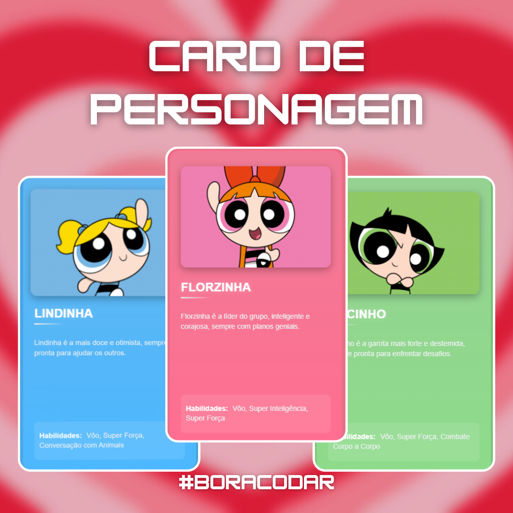

# Powerpuff Girls Cards

 

## Descrição

**Powerpuff Girls Cards** é uma aplicação simples que exibe cards dos personagens das Meninas Super Poderosas. Com uma interface intuitiva, os usuários podem visualizar informações sobre cada personagem de forma organizada e atraente.

## Funcionalidades

- Exibir cards para cada personagem das Meninas Super Poderosas.
- Mostrar nome, imagem e descrição de cada personagem.
- Design responsivo e colorido, inspirado na série animada.

## Tecnologias Utilizadas

- **HTML5**: Estrutura básica da aplicação.
- **CSS3**: Estilização da interface, com foco em design e responsividade.
- **JavaScript**: Utilizado para manipulação de dados e interatividade.
